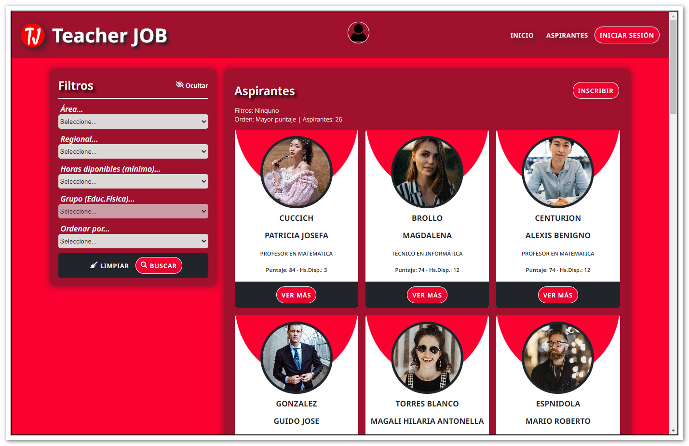
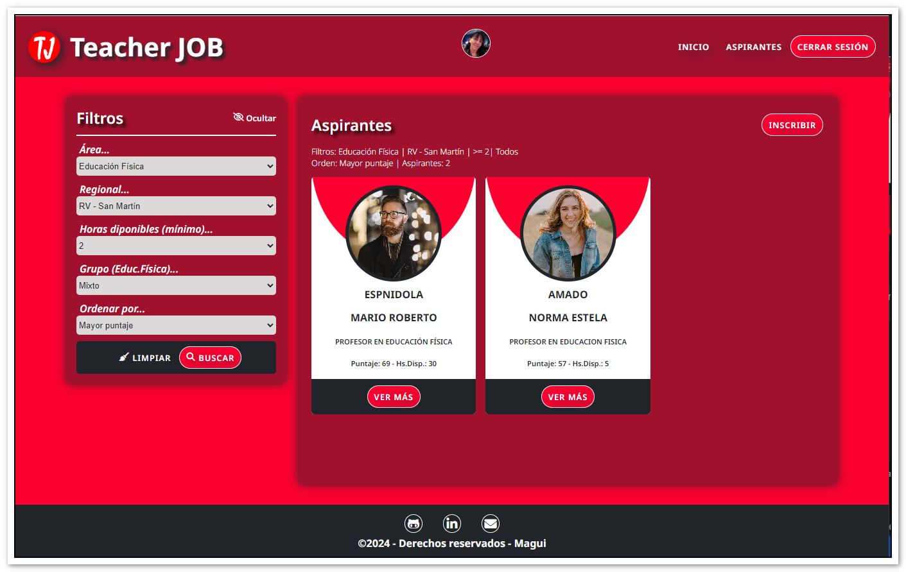
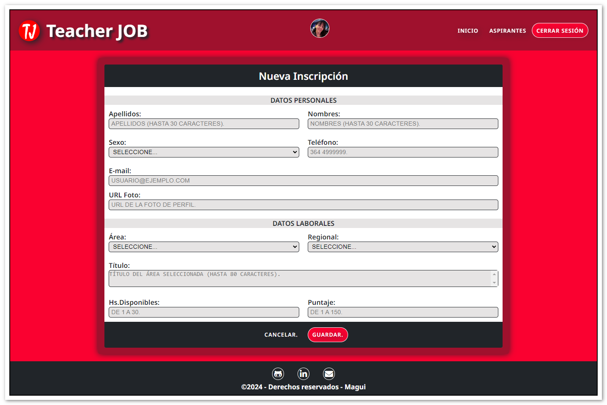
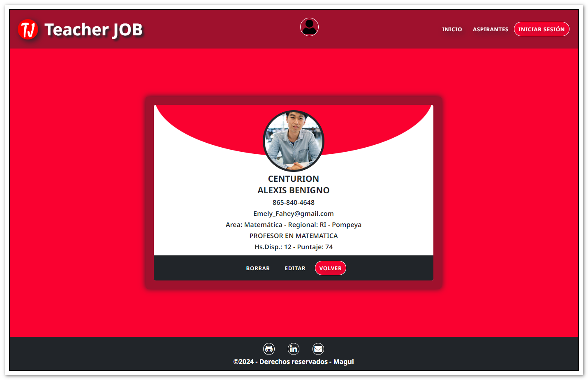
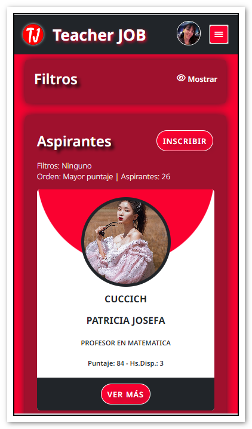
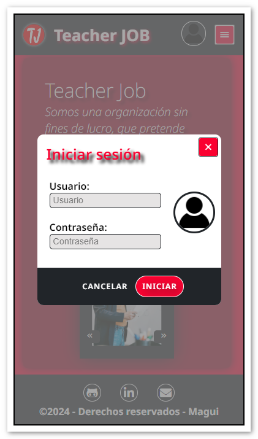

<!-- ===========================================================
                            PRESENTACIÓN
     =========================================================== -->

   

---

---

## Tabla de Contenidos:

- [Teacher JOB](#teacher-job)
- [Tecnologías](#tecnologías)
- [Menús](#menús)
- [Mobile](#mobile)
- [Contáctame](#contáctame)

---

 
<!-- ==================================================
                         CONTENIDO 
     ================================================== -->

## _Teacher JOB_

[:top:](#tabla-de-contenidos)  

> Las aplicaciones web, comúnmente conocidas como apps, se han convertido en una parte esencial de nuestra vida cotidiana. Las apps se han consolidado como nuestras aliadas, simplificándonos tareas diarias complejas, como otras no tan complejas como, por ejemplo la búsqueda de empleo.   `Teacher JOB` constituye una herramienta ideal para cruzar de forma efectiva profesores que buscan horas cátedras donde desempeñarse, e instituciones educativas que las ofrecen. Se trata de un espacio en el cual se inscriben a profesores con sus datos más relevantes y los directivos de instituciones pueden consultar esos datos para luego contactar a los profesores.

   

La aplicación `Teacher JOB`, fue diseñada de tal manera que puede ser utilizada en diferentes dispositivos, lo que implica un correcto diseño responsive.

   

 

Teacher JOB es una app desarrollada como Trabajo Final del "Módulo 4 - Asincronismo", de la capacitación de `"Desarrollo Frontend"` dictado por [ADA ITW](https://www.linkedin.com/school/ada-itw/), y se encuentra incluido en mi `Portfolio Personal`, de tal manera de reflejar el grado de avance, apropiación y uso de los conocimiento adquiridos y asimilados durante la capacitación.

> [!NOTE]
> Visite mi portafolio personal: [PORTFOLIO](https://maguibrollo.github.io/ADA_Portafolio_mod01_tf/).

 

## _Tecnologías_

[:top:](#tabla-de-contenidos)  
Teacher JOB fue desarrollada utilizando las siguientes tecnologías:

|  |                                                       |  |
| :------------------------------------------------------------------------------------------------------------------------: | :--------------------------------------------------------------------------------------------------------------------------------------------------------------------------: | :------------------------------------------------------------------------------------------------------------------------------------: |
|   Lenguaje de marcado de hipertexto. Consiste en marcas basado en etiquetas que otorgan la estructura básica de la app.    | Sass es un procesador CSS. Permite generar, de manera automática, hojas de estilo, con características que no tiene CSS, y que son propias de los lenguajes de programación. |            Javascript es un lenguaje de programación. Otorga interactividad a las distintas secciones que conforman la app.            |

 

## _Menús_

[:top:](#tabla-de-contenidos)  

La aplicación cuenta con los siguientes menús: [Inicio](#inicio), [Aspirantes](#aspirantes) e [Iniciar sesión](#iniciar-sesión).

---

### _Inicio:_

[:top:](#menús)  
Al iniciar la aplicación, se visualiza un mensaje de bienvenida con un carrusel de imágenes alusivas.

 

   

---

### _Aspirantes:_

[:top:](#menús)  
Este menú es el corazón de la aplicación, ya que presenta todas las alternativas de búsqueda de profesores, inscripción, consulta, edición y eliminación de inscripciones.  
En primer lugar, al acceder a este menú se puede ver el listado completo de Aspirantes inscriptos, ordenados por mayor puntaje.

   

 

> [!NOTE]
> Al realizarse una búsqueda o solicitud de visualización, se mostrará un spinner que informa que la app está realizando la tarea solicitada.

   

> [!NOTE]
> Cuando la información visualizada -listado, ver más, editar, inscripción- habilite el scroll vertical se puede visualizar la aparición de una flecha que le permitirá volver al menú de manera más práctica.

   

En la **sección `Filtros`** los directivos de instituciones pueden filtrar la búsqueda por Área, Regional, Horas, Grupo (para Educación Física) y el Orden por puntaje. Esta sección puede ocultarse y volver a visualizarse.  
Luego de seleccionar las opciones de filtrado se deberá seleccionar "Buscar", para dar inicio al proceso de filtrado. Al finalizar el proceso se puede observar, además de las fichas, los datos del filtrado, orden y cantidad. El resultado del filtro se visualiza en la sección Aspirantes.

 

   

 

En la **sección `Aspirantes`** se visualiza el listado de aspirantes correspondiente al filtro aplicado, además del mensaje que informa el filtro, el orden y el total de aspirantes listados.
 

   

`Inscripción`: En esta sección también es posible, si se ha iniciado sesión, realizar la inscripción de un nuevo aspirante, completando todos los datos, ya que todos los datos son obligatorios.
 

   

 

En la **sección `Ver más`** de cada ficha de cada profesor, es posible visualizar más información del profesor.
 

   

Si se ha iniciado sesión, se podrá acceder a `Editar` y `Borrar`.  
Al seleccionar `Editar`, se puede acceder a la ventana de editar los datos de inscripción del aspirante que se está visualizando. Al desplazar la ventana hacia abajo se observará la edición completa.

| |  |

 

Si se ha seleccionado la opción `Borrar` antes de que se realice la eliminación definitiva, se deberá aceptar la opción correspondiente.
 

   

 

---

### _Iniciar Sesión:_

[:top:](#menús)  

Por medio de este menú es posible iniciar o cerrar sesión. Solo podrán iniciar sesión personal habilitado.

| |  |

 

Si al intentar iniciar sesión, se comete un error en el usuario o contraseña, se informará mediante mensaje.

   

 

Al lograr iniciar sesión correctamente, se observará en la parte superior la imagen correspondiente al usuario.

   

 

---

## _Mobile_

[:top:](#tabla-de-contenidos)  
Todas las opciones antes descriptas, se encuentran disposnibles para los diferentes dispositivos móviles.

|                      Inicio                      |                      Menús                       |
| :----------------------------------------------: | :----------------------------------------------: |
|  |  |

 

|                         Filtros                         |                     Ver más                      |                      Sesión                      |
| :-----------------------------------------------------: | :----------------------------------------------: | :----------------------------------------------: |
|  |  |  |

---

## _Contáctame:_

[:top:](#tabla-de-contenidos)  

---

